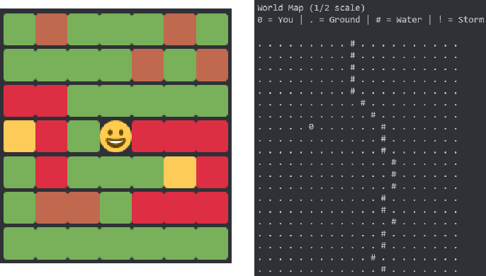
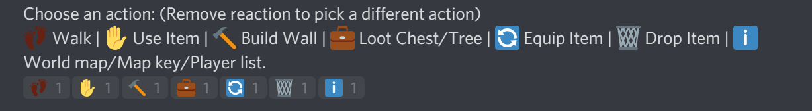

# How To Play Fortnite Bot 2

*All images taken during an in development build of the game and may look different from the final build*

At its core, fortnite bot is a turn based battle royale game. The map is comprised of tiles that you can move on. Think of it like a game of chess, except its has guns and it's on discord. The end goal of the game is to be the last player alive.

## The World

The most important thing to understand how to play is how the world is structured. The world is made up of many colored tiles arranged in a large gird. You can move around these tiles. Standing on certain tiles can allow or prohibit you from doing certain actions (elaborated on in the actions section). On each new turn, you will get a 7x7 grid representing the tiles around them. A world map is also accessible for you to get your position in relation to the entire map.

*7x7 map & world map*

The following is a key as to what each color represents
* Green: Grass
* Blue: Water
* Brown: Tree
* Yellow: Chest
* Red: Wall

Each map is pseudo-randomly generated with rivers and buildings. Rivers span across the map from side to side or top to bottom. Buildings are scattered around and are made of wall tiles. Buildings feature chests full of items so make it a priority to get to them before other players do!

## Actions

On every turn, you can perform a variety of actions. Each action is controlled using reactions. Most actions will require you to end your turn (unless otherwise stated), meaning you cannot do other actions after committing to it. If you perform an action that does not end your turn, simply unreact the action you performed to be able to perform another action. The following are the actions you can perform:

* Walk: Lets you move around the map. You can walk in one of four directions. You can move at a maximum speed of three tiles in one turn. You will be stopped if you collide into a wall.
* Use: Uses an item (weapons, health packs, etc). Use is changed depending on what item is equipped. Weapons will prompt you to choose a direction to fire at. Healing items will just get consumed. You cannot use items while standing in water.
* Build: Builds a wall in a certain direction. Building costs 10 materials.
* Loot: Gets items from chests or +10 materials from trees.
* Equip (*does not end turn*): Changes what item is used on the use action.
* Drop (*does not end turn*): Drops an item, removing it from your inventory.
* Info (*does not end turn*): Shows the world map, map key, and player list.

## Combat

If you encounter another player, you have an opportunity to kill them. When using a weapon, consider the damage and the range. Weapon ranges are split into 3 categories: short, medium, and far range. Short range will hit up to 1 tile in a direction, while far range goes 3 tiles.

On the other hand, weapons cannot shoot through walls, rather they'll destroy walls first. Make sure you stock up on materials (loot while on tree tile) so you can build walls and defend. After taking damage, you can use healing items. Some items only heal health, some only heal shield, and some do both.

## The storm

The storm is a circular mass of storm tiles. It'll first appear near the middle of the game and it will slowly shrink on each turn. The game will warn you when the storm starts shrinking. You can also do the info action to check the storm progress on the world map. You will take damage if you are standing in the storm.
