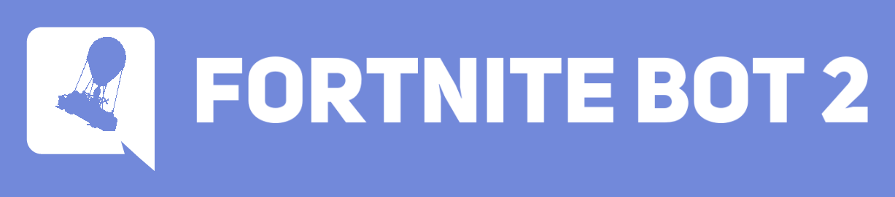
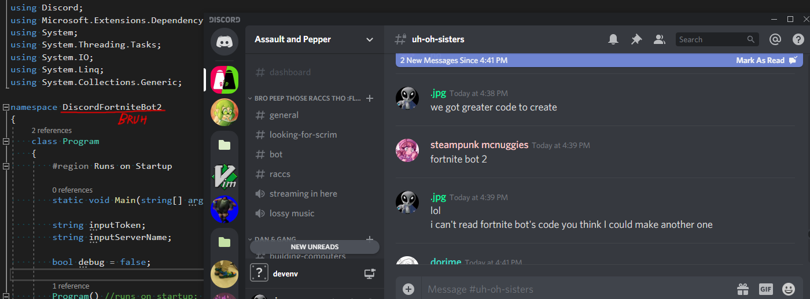

Another Fortnite game playable in a discord client. This project is a sequel/rewrite to an existing project created in March 2019. Fortnite Bot 2 began as a concept in January 2020. The project's anticipated completion time is before April 2020. 

# Design Docs

## Goals
Overall we want to create a game that has more visual elements. Complicating the game with more features without changing the user interface and gameplay can quickly become confusing to many. Fortnite Bot 1 relied on a lot of text to have the user visualize what the world looks like.

New features to be considered:
* Building materials that the player can collect.
* Buildable objects that players can place onto the map.
* Destructable objects that could provide loot and reward.
* A zoomed in map alongside an entire world map.
* More world features instead of just land and houses.
* Supply drops that spawn in the late game.

Designs and features to change from Fortnite Bot 1:
* Weapons with variable range.
* Players drop loot when killed.
* A shield meter seperate from the health bar.
* Make the storm close in on a random location.

Some more questionable ideas:
* No more turn based gameplay.
* Choose where you start on the map at the start of the match.
* Join game after its already begun.
* Quit game after inactivity or if specified.
* World map generated using an image instead of emotes.

## User Interface
The biggest change planned is a user interface revamp. Minimise the text on screen and use visual elements in order to give the player information. The current proposal to address this is to have 2 map views rather than one. The traditional world, seen in Fortnite Bot 1,  map will stay. This serves as a reference on where the player is on the map and where the major structures are located. This map will be refered to as the **world view**. The second map provides more detail on whats around the player. This includes loot, players, and detailed map elements. This map will be refered to as the **player view**.

## World
New elements should be added in order to make a more dynamic world. Destrucable objects that bullets cannot pass through. Chests that you can gain items from. Rivers and lakes that you cannot shoot when swimming in. Trees you can get building materials from. Buildings on the world map will no longer be reduced to better loot chance, rather buildings that you can enter and loot from.

## Gameplay
Gameplay will be controlled using reactions in order to simplify the user experience. Adjustments will be made in order to remove the reliance on keyboard input. Shooting weapons will be changed into a 4 (or 8) way directional fire. With reactions, the turn timer could be reduced. The turn timer could be replaced with a system that waits for all players to finish their turn if an auto kick feature is added.

Weapon balance can be changed. Like in Fortnite Bot 1, weapons will be balenced on ammo amount and the damage they output. The range factor will be changed into real range. Split up into low, medium, and high just to keep it simple. Lower range weapons will typically do more damage to reward players that can close distance.

## Code Structure
The following classes should be necessary:
* Program
* Player
* Item

The program class will handle all discord communication and game processing. Like in Fortnite Bot 1, the gameplay states will be split into phases (Pregame, Ingame, Postgame). Each turn process all data happening at once.

The Player class and the Item class represent the classes needed to create said objects. The player object is the player and the info tied to them. The items are stored in the players inventory using an array in the player class.

Other smaller classes may be added.

